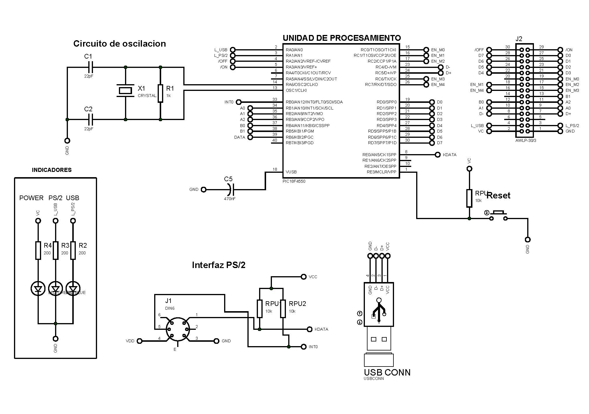
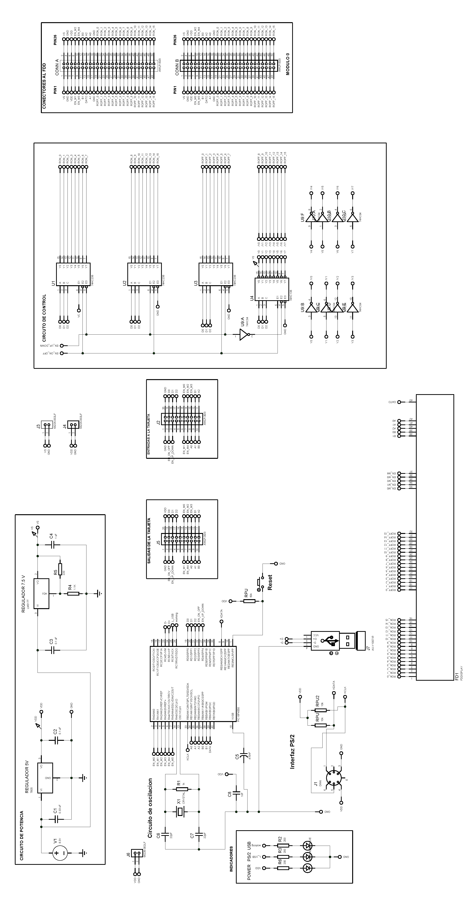

# Flip-Disc-Display

Design and implementation of the control card for a “flip-disc display” sign display.

The main goal of this project is the design and implementation of a control board for the Flip Disc Display. The display currently belongs to the Automatic Engineering Faculty. Is has the inconvenient that the characters’ map that form the showing message is stored in an external EPROM which makes it necessary to re‐record the memory to change the information. The solution that is offered here to set the display in good working order is based on the creation of three boards, one for the processing, one for control and the other one for power supply. The microcontroller to be used belongs to the Microchip family and it is the PIC1F4550 which will store in its internal memory the characters’ map corresponding to the showing message, which will be entered to the display using a PS/2 keyboard or a Graphic User Interface (GUI) through USB communication.

For more information address to the documentation folder.

